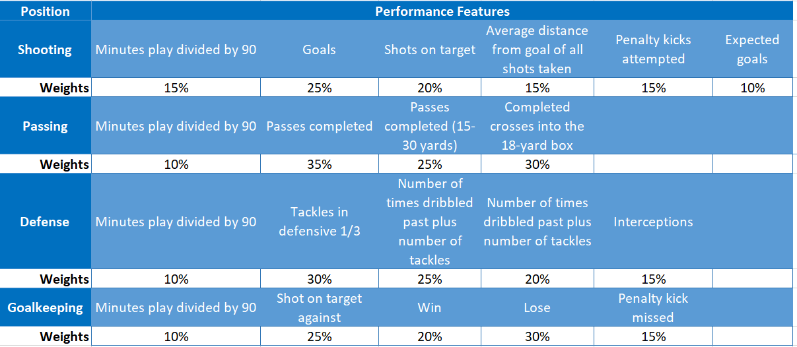
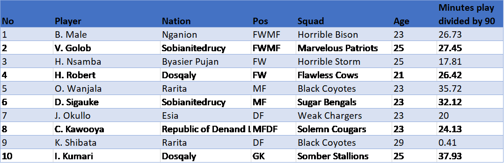

# SOA Challenge: Rarita FSA League Project Showcase

BY ML Group

---
## Project Overview

This page briefly showcases the results and methodology for constructing Rarita's national football team, key strategies to be implemented, 1o-year profit & loss analysis, relevant economic impacts and risk considerations. We applied machine learning models such as linear regression,shrinkage models and ensemble models for feature selection and also built a discounted cash flow model to present the future profit or loss positions of the strategy proposed. We conducted economic analysis by regions...

> To find more details on the SOA Challenge, please click [2022 SOA Research Challenge](https://www.soa.org/research/opportunities/2022-student-research-case-study-challenge/).

## Project Objectives

The project aims to  help Rarita form a competitive national football team, which is expected to boost the country’s economy. With the competitiveness defined as follows:

>
* The national team should rank within the top ten members of the FSA for the season within the next five years.
* There is a high probability of achieving an FSA championship within the next 10 years.

With machine learning models used to select players, discounted cash flow models for projecting 10-year revenue and expense and economic analysis conducted, there are many assumptions embedded in the analysis and risks  also he uncertainty of the analysis provided in the report. 

## Team Selection

### Methodology

The modelling steps are outlined below:

>
* Plot correlation matrix to explore the linear relationship between tournament ranking and all player performance features.
* Aggregate player level data to national team level by addition or taking averages of the individual performance variables. 
* Conduct exploratory data analysis to visualize the distinctive impacts of the selected variables on the independent variable, namely the tournament ranking results.
* Use linear, shrinkage and Ensemble models with relatively non-highly-correlated variables as inputs to quantify the relationships between the performance features and output of tournament ranking. 
* Select performance features and assigned weights based on the importance and predictive powers of each variable in the constructed models.
* Rank each performance features selected to eliminate the effects of large value gaps. 
Calculate an overall rank for each player based on weighted average rank of those selected performance features.
* Select 21 players with the highest ranks with filtered positions and substitute players are also selected based on their ranking and age.

> For detailed R code, please click  [R code: linear and shrikange models](sample-data-clean.ipynb) for linear and shrinkage models, click  [R code: Ensemble models](sample-data-clean.ipynb) for tree-based models.

---
Data limitatoin: 

>
* The ‘Tournament Passing’ and ‘Tournament Defense’ data in 2020 is missing. As player performance features are selected by variable significance, the unavailability of 2020 tournament data disallows the split of training and test datasets on aggregate team level. This can lead to not optimal model chosen to support the process of selecting players.
* There are negative data entries across some columns. We noticed that the negative values approach to zero closely with the lower bound of -0.1 and as we valued the ranking not the numbers, so we do not replace negative values. This may affect the model slightly.
* There are also some missing values across columns in the dataset. If data is missing in this way, we choose MICE algorithm to simulate data for missing value. This may decrease the accuracy of the model.

---

We defined the competitiveness and potentials of players by the overall rank and the selected performance features. The features selected and their relevant weights are outlined below.

### Assumptions

>
*	All player performance features are measured and recorded reasonably and accurately. The relative values of performance features not the values themselves show the competitiveness of players. 
*	The positions described in four letters are assumed to be the same. The reason for inconsistency in position abbreviation is salary change in the same year.

### National football team player list

We expected the national football team to implement a 4-2-4 flexible strategy consisting of 4 forwards, 2 midfields, 4 defense and 1 goalkeeper. To implement the flexible strategy successfully, at least one forward position and defense position can also play midfield, so the 4-2-4 team structure can easily convert to 3-4-3 or other competitive structures dependent on opponent’s strategy. The 10 replacement players selected and some statistics are outlined below.

> National football team player list

We selected substitute players using the same weighted average ranking with an additional criterion of age. We assumed that average retirement age for all football players is around 35 years old. This means players with current age above 25 are subject to replacement. The 11 players selected and some statistics are outlined below.

>  National football team replacement player list 

## 10-Year Strategy

For the pursuit of world-wide competitiveness, Rarita’s national football team should focus on strategies driving management, brand development, growing commercial revenue and other revenues, improving overall popularity and positions in tournaments. We outlined the three different sources of revenue and based on the profit & loss analysis, we discovered the addtional funding need for Rarita's national football team.

### Sources of revenue and additional funding

All three sources of revenue outlied below significantly rely on brand development to attract new supporters and improve fans base. The growth of revenue can be achieved by both improving rankings in competitions and setting up effective and practical commercialization strategies.

>
* Matchday revenue: ticket sales at local stadiums, Stadium tours and loaning out the stadium for filming
* Broadcast revenue: TV deals 
* Commercial revenue: mechanization including sales of all jerseys, hats, scarves, jackets and badges, large contracts with sponsors.

> Assuming all strategies are successfully practiced, the relevant profit and loss can be estimate with present value of 21335.49 million shown below.

From the projection above, except the initial funding of 995 million doubloons, non-governmental funding is needed at the end of 2023. The funding source of 350 million doubloons can be achieved by multiple long-term extensive commercial sponsorship or transferring team ownership to large corporates or constructing global membership.

### DCF model and methodology

> 
*	Calculate total revenue and expense at the end of 2020 using the product of 2020 population and revenue per capita data.
*	Predict the total expense growth rate and revenue growth rate for each year for 2021 and for future 10 years by analyzing the historical trend and conducting relevant researches
*	Calculate total revenue and expense using the previous year figure timing the growth rate for 2 scenarios with and without national football team built.
*	Substract the predicted figures of the 2 scenarios above to calculate the direct revenue and expense of the national team

> The DCF model for the 2 scenraios is shown below.

---
Assumptions: 

* Three-stage separation model: There will still be residual impacts of COVID-19 pandemic on global economy in 2022 but minimal impacts for 2022 onwards. For 2023-2027, the team will be subject to multiple changes including player composition, revenue and expense composition due to successful implement of strategies and achieving higher rankings in the FSA and other potential changes in short-term.  At this stage, the team is expected to experience revenue boost and expense management. After Year 7, the team is expected to be mature in team operation and should be subject to long-term expense and revenue growth rate. The key assumptions for the 3-stage separation model is shown below.

*	Total expense and revenue growth rates follow a normal distribution with mean and standard deviations calculated from historical data.
*	Future statistics for RFL are assumed to keep the trends analyzed from the historical data provided. 

> An example of historical data analysis is shown below
> 

> Please note: The proportion assumptions of total revenue and total expense do not affect the overall profit as they are calculated using the total revenue (expense) timing the corresponding proportion assumption.

---

> Data limitation: Tournament and league data only involves the past two consecutive years of 2020-2021. No links between the improvement of ranking and past revenue
>  growth and expense growth can be explored due to limited data. This results in higher dependence in assumptions that are the sources of uncertainty.

### Revenue growth strategy

> 
> 

## Economic Impacts

## Risk Considerations

### Congrats on completing the [2022 SOA Research Challenge](https://www.soa.org/research/opportunities/2022-student-research-case-study-challenge/)!

>Now it's time to build your own website to showcase your work.  
>To create a website on GitHub Pages to showcase your work is very easy.

This is written in markdown language. 
>
* Click [4001 link](https://classroom.github.com/a/ggiq0YzO) to accept your group assignment.
* Click [5100 link](https://classroom.github.com/a/uVytCqDv) to accept your group assignment 

#### Follow the [guide doc](Doc1.pdf) to submit your work. 
---
>Be creative! Feel free to link to embed your [data](player_data_salaries_2020.csv), [code](sample-data-clean.ipynb), [image](ACC.png) here

More information on GitHub Pages can be found [here](https://pages.github.com/)

## Summary
